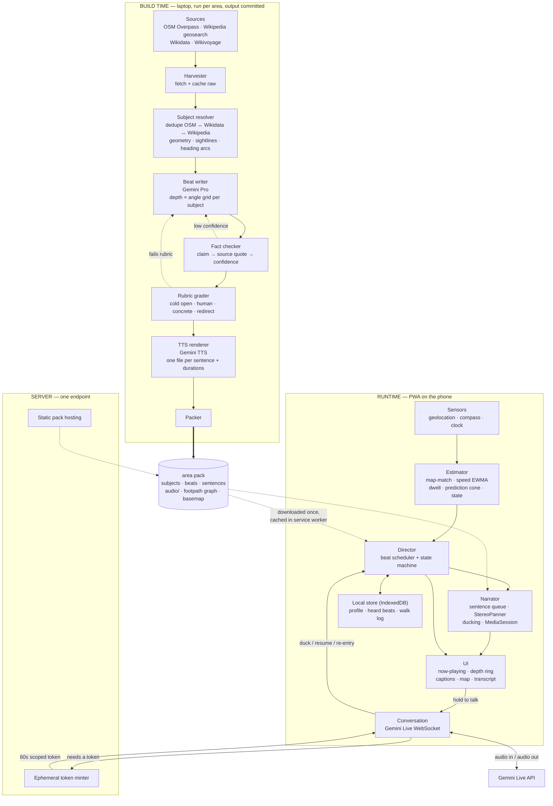
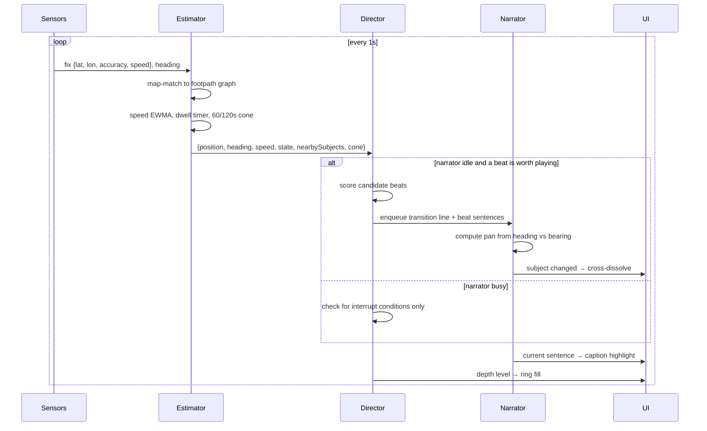
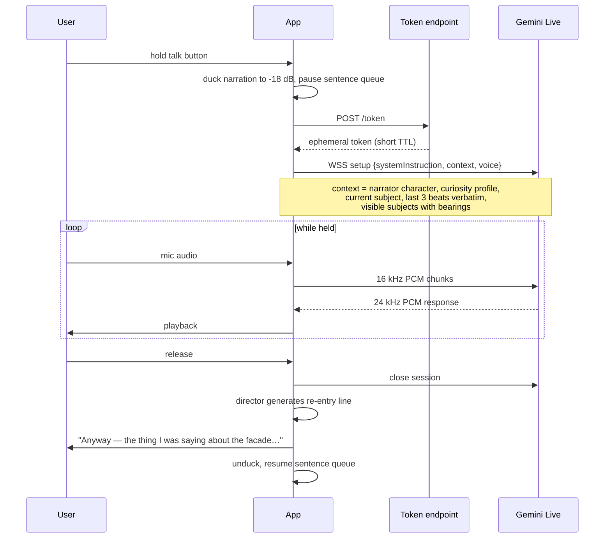

# Wander — architecture

Companion to `BRAINSTORM.md`. This is the buildable design.

**Stack decision: Gemini only.** One personal AI Studio key covers beat authoring,
fact-checking, TTS rendering, live conversation and search grounding, all on the
free tier. No work accounts, no second vendor, no billing surprises.

---

## 1. Principles

1. **Two speeds.** Everything expensive and slow happens at *build* time and gets
   committed. Everything at *runtime* is scheduling, playback and one live socket.
2. **Client-heavy, server-almost-nothing.** The only thing the server must do is
   mint short-lived Gemini tokens so the API key never ships to the browser.
3. **Offline-first.** A walk works with the phone in airplane mode. Network buys
   you conversation and the live layer, nothing else.
4. **The pack is the contract.** Build-time emits a self-contained area pack.
   Runtime knows nothing about Wikipedia, OSM, or how beats were written.
5. **One character, many lenses.** The narrator's voice is fixed. What it chooses
   to talk about is driven by a curiosity profile.

---

## 2. System



---

## 3. Build-time pipeline

Run once per area. Output is committed to the repo, so the app has no build-time
dependency at runtime and you can diff content changes in git.

### 3.1 Harvest

For a bounding box or polygon:

- **OSM Overpass** — buildings, memorials, historic tags, footpaths, entrances.
  Snapshot to disk; never call Overpass from the app.
- **Wikipedia geosearch** — `action=query&generator=geosearch` at the area
  centroid, radius to taste. Pull extracts, coordinates, page images.
- **Wikidata** — structured facts by QID: inception date, architect, style,
  named-after, heritage designation. Free of prose, so it's the reliable spine.
- **Wikivoyage** — consistent article structure makes it the best source for
  "what a visitor would want to know."

Cache everything raw. Reruns should be free.

### 3.2 Resolve subjects

Merge the three identifier spaces into one canonical `Subject`. OSM `wikidata`
tags do most of the work; fall back to name + proximity matching.

Then compute the geometric metadata the director needs:

- **Relevance polygon** — where you have to be for this subject to be worth
  talking about. Not a circle: for a long facade it's a strip along the street.
- **Sightlines** — from which stretches of footpath is it actually visible.
  A crude but effective version: sample points along nearby footpaths, ray-cast
  against building footprints, keep the ones with line of sight.
- **Heading arc** — the bearing range from each sightline point to the subject.
  This is what makes "on your left" true and what drives stereo panning.

### 3.3 Write beats

For each subject, generate a grid rather than one paragraph:

|  | depth 1 (headline, ~15s) | depth 2 (story, ~30s) | depth 3 (deep cut, ~45s) |
|---|---|---|---|
| **history** | ✓ | ✓ | ✓ |
| **engineering** | ✓ | ✓ | — |
| **architecture** | ✓ | ✓ | ✓ |
| **human** | — | ✓ | ✓ |
| **myth** | — | ✓ | — |

Not every cell fills; aim for 4–8 beats per subject. Fourteen Harvard Yard
subjects gives roughly 70–100 beats, about 12,000 words. That's a couple of
dollars of Gemini, once.

The prompt carries the fixed narrator character, the target angle, the target
duration, the retrieved sources, and the rubric. Critically it also carries
**what has already been written for this subject**, so the engineering beat
doesn't repeat the history beat's opening.

### 3.4 Fact check

Second pass, different prompt: decompose each beat into atomic claims, and for
each claim find a supporting span in the retrieved sources. Emit
`{ text, source_url, quote, confidence }`.

- `confidence >= 0.8` → state it plainly
- `0.5–0.8` → hedge in the prose ("the usual story goes…")
- `< 0.5` → regenerate the beat without it

Myth beats are the exception: they deliberately carry a low-confidence claim
*and* its refutation, flagged so the checker doesn't strip them.

### 3.5 Grade against the rubric

Cheap model, four boolean checks: does it open on something other than the
building's name; is there a named human being; is there a concrete detail rather
than a superlative; does the last line redirect your attention. Fewer than three
out of four, regenerate. Cap at two retries and log the failures for hand-editing
— for a personal project, hand-editing the best twenty beats is completely
reasonable and will do more for quality than any prompt tuning.

### 3.6 Render TTS

Split each beat into sentences. Render each sentence to its own MP3 and record
its duration. Sentence-level is the whole point: it gives caption sync, clean
barge-in boundaries, graceful truncation, and reordering within a beat.

Beat duration is the sum of its sentence durations, which is what the scheduler
fits against — so the durations must be measured, not estimated.

### 3.7 Pack

```
packs/harvard-yard/
  manifest.json      # id, bbox, version, counts, checksum
  subjects.json
  beats.json
  graph.json         # footpath nodes + edges for map-matching
  basemap.pmtiles    # Protomaps extract
  audio/
    <beatId>/0.mp3 1.mp3 2.mp3 …
```

---

## 4. Data model

```ts
type Subject = {
  id: string
  name: string
  wikidata?: string
  center: [lon, lat]
  relevance: GeoJSON.Polygon      // where this is worth talking about
  sightlines: Array<{ at: [lon, lat]; headingArc: [number, number] }>
  photo?: string
}

type Beat = {
  id: string
  subjectId: string
  depth: 1 | 2 | 3
  angle: 'history' | 'engineering' | 'architecture' | 'human' | 'myth' | 'civic'
  themes: Record<string, number>   // soft tags for profile matching
  durationS: number                // measured, not estimated
  prereq: string[]                 // never spoil a payoff
  exclusiveGroup?: string          // pick at most one
  cooldownDays: number
  sentences: Array<{ text: string; audio: string; durationS: number }>
  claims: Array<{ text: string; sourceUrl: string; quote: string; confidence: number }>
}
```

---

## 5. Runtime loop

Ticks at 1 Hz. Everything below runs on-device with the pack in memory.



### Estimator outputs

```ts
type Estimate = {
  position: [lon, lat]
  matchedEdge: string | null       // null = off the path network
  heading: number | null           // degrees, null if compass denied
  speedMps: number                 // EWMA, ~10s window
  dwellS: number                   // seconds near the current subject
  state: 'TRANSITING' | 'APPROACHING' | 'DWELLING'
       | 'ACCELERATING' | 'OFF_ROUTE' | 'IDLE' | 'IN_CONVERSATION'
  visible: Array<{ subjectId: string; bearing: number; distanceM: number }>
  cone: string[]                   // subject ids plausibly reachable in 120s
}
```

**Map-matching matters more than it sounds.** Raw GPS under the trees in Harvard
Yard drifts 10–20 m, which reads as motion when you're standing still and kills
the dwell timer. Snapping to the footpath graph turns that noise into "still on
edge 412, hasn't moved."

---

## 6. The director

### Scoring

Every tick, when the narrator is free, score every beat that is currently legal:

```
legal(beat) =
      beat not heard this walk
  and beat outside its cross-session cooldown
  and all prereqs already played
  and no sibling from its exclusiveGroup played
  and subject is inside relevance polygon
  and (no heading available OR bearing within headingArc)

score(beat) =
      themeMatch(profile, beat.themes)        // 0..1, the lens
    × depthFit(beat.depth, dwellS, state)     // dwelling pushes depth up
    × durationFit(beat.durationS, timeToExit) // hard gate: 0 if it won't finish
    × proximityWeight(distanceM)
    × noveltyBonus(subject)                   // haven't covered this subject yet
    × sourceConfidence(beat)
```

`durationFit` is the important one and it is a gate, not a multiplier:

```
timeToExit = distanceToRelevanceBoundary(position, heading) / max(speedMps, 0.3)
durationFit = beat.durationS <= timeToExit * 0.85 ? 1 : 0
```

If nothing scores above a floor, **say nothing**. Silence is the default, not the
failure case. Track rolling talk density and suppress when it exceeds target.

### States

| State | Enter when | Director does |
|---|---|---|
| `TRANSITING` | moving, nothing scoring above floor | silence, or a connective beat about the street/era. Prefetch cone beats. |
| `APPROACHING` | a cone subject will be in range in 20–40 s | pick a beat that fits estimated time-in-zone; emit transition first |
| `DWELLING` | `speedMps < 0.3` for >15 s inside relevance | escalate depth 1→2→3, then **lateral** (other visible subjects), then **meta** (block, era, architect elsewhere) |
| `ACCELERATING` | speed rising, or 2 skips in 60 s | depth 1 only, raise silence floor |
| `OFF_ROUTE` | `matchedEdge == null` or off planned route | silently re-rank. Never announce it. |
| `IN_CONVERSATION` | talk button held | duck, hand off, generate re-entry on close |
| `IDLE` | stationary >3 min, nothing nearby | stop entirely, drop to low-power location |

### Transitions

Before each beat, a one-sentence bridge conditioned on `(previousBeat, nextBeat,
walkingDirection)`. Two ways to get it:

- **Precomputed** for likely pairs at build time. Free, offline, no latency.
- **Live** via Gemini Flash for pairs you didn't anticipate. ~200 tokens, cached
  after first use.

Start with precomputed for adjacency pairs in the footpath graph; that covers
most real walks. Fall back to a small set of generic bridges rather than calling
the network mid-walk.

---

## 7. Conversation



### Gemini Live constraints that shape the design

- **Ephemeral tokens.** The docs recommend client-to-server WebSocket for latency,
  but with ephemeral tokens rather than the raw API key. Hence the one server
  endpoint. Everything else can be static hosting.
- **Search grounding and function calling are mutually exclusive in one setup.**
  You cannot enable `google_search` alongside custom tools in the same session
  config. So don't try to give the conversational agent tools like
  `navigateTo(subject)`. Instead run search-grounded sessions and detect intent
  by parsing the output transcript — "take me to Memorial Hall" is easy enough to
  catch, and it avoids blocking.
- **Function calling is synchronous on the 3.1 Flash Live models.** The model
  stalls until you return a tool response. Another reason to keep tools out.
- **Audio format is fixed.** 16-bit PCM, 16 kHz in, 24 kHz out, little-endian.
  You'll need an AudioWorklet to resample mic input.
- **Open the socket only while talking.** A session held open for a 90-minute walk
  bills every minute of silence as audio input tokens, and holds a radio awake.

### Context injection

Keep the system instruction stable across turns so prompt caching holds. Put the
volatile part (current subject, recent beats, bearings) in the first user turn.
Cached input is dramatically cheaper than uncached; a stable prefix is what
unlocks it.

---

## 8. Persona: one character, many lenses

### The character (fixed)

> A narrator who cannot look at anything without asking how it works and who
> decided. Treats a 1720 brick building as an engineering artifact with a budget,
> a client, a constraint, and somebody who got fired over it. Delighted by clever
> solutions, unimpressed by prestige, willing to say when something is ugly.
> Explains the physics of why the bricks are that colour, then tells you who paid
> for them and why they were furious. Never lectures; always mid-thought.

This string lives in one file and is injected into beat authoring, transition
generation and the Live session's system instruction. Changing it changes the
whole app, which is the point — it should be one decision, not scattered.

### The lens (per user)

```ts
type CuriosityProfile = {
  themes: {
    history: number; science: number; engineering: number; architecture: number
    people: number; scandal: number; civic: number; art: number
    food: number; nature: number
  }                                  // 0..1
  style: {
    narrativeGrip: number            // prefer arcs over fact lists
    depthBias: number                // how eagerly to escalate depth
    talkDensity: number              // target fraction of walking time
    irreverence: number              // how opinionated it's allowed to be
  }
}
```

Your starting profile, from what you described:

```json
{
  "themes": {
    "history": 0.9, "science": 0.95, "engineering": 0.95, "architecture": 0.85,
    "people": 0.7, "scandal": 0.5, "civic": 0.5, "art": 0.35,
    "food": 0.2, "nature": 0.4
  },
  "style": {
    "narrativeGrip": 0.9, "depthBias": 0.75,
    "talkDensity": 0.4, "irreverence": 0.6
  }
}
```

### How it learns

Three signals, all free:

| Signal | Effect |
|---|---|
| Skip a beat | `themes[angle] -= 0.05` |
| Dwell through a full beat and pull depth 3 | `themes[angle] += 0.05` |
| Ask a question | classify the question's topic, `themes[topic] += 0.08` |

Questions are the strongest signal by far — what someone asks about unprompted is
a much better read on curiosity than what they tolerated hearing. Clamp to
`[0.1, 1.0]` so nothing dies permanently, and decay toward the baseline slowly so
one bad walk doesn't reshape the profile.

For v0 this is a JSON file you edit by hand. It's your app.

---

## 9. Server surface

Deliberately tiny. One function and a static bucket.

```
POST /api/token   → { token, expiresAt }    // mints a Gemini ephemeral token
GET  /packs/*                                // static, CDN-cached, immutable
GET  /w/:slug                                // rendered walk artifact (v1)
POST /api/walk                               // upload artifact for sharing (v1)
```

Cloudflare Pages plus one Worker, or Vercel plus one edge function. Free tier on
either. HTTPS is non-negotiable — geolocation and `DeviceOrientationEvent` both
require a secure context.

---

## 10. Local state

IndexedDB, three stores:

- `profile` — curiosity profile, narrator settings, chosen voice
- `history` — `{ beatId, playedAt, completed }`, drives anti-repetition and
  cross-session cooldowns
- `walks` — the current walk log: position samples, beats played, questions
  asked, photos, saves. This *is* the artifact; rendering it afterward is just a
  view over this record.

Service worker caches the pack. Downloading an area is literally
`caches.addAll(manifest.files)`.

---

## 11. Free-tier budget

| Stage | Volume for Harvard Yard | Gemini free tier |
|---|---|---|
| Beat authoring | ~100 beats, ~12k words out, ~400k tokens in | Fits with backoff; run overnight if rate limited |
| Fact checking | ~400 claims, small prompts | Fits |
| Rubric grading | ~100 short calls, cheap model | Fits |
| TTS rendering | ~800 sentences, ~75k characters | Watch the daily cap; chunk across two days if needed |
| Live conversation | Only while the button is held | Minutes per walk, not hours |
| Search grounding | Only for the live layer | 5,000 grounded prompts/month shared across Gemini 3 |

The build-time stages are the only place you'll hit limits, and they run once.
Write the pipeline to be **resumable** — checkpoint after every subject so a rate
limit doesn't cost you the run.

---

## 12. Repo layout

```
wander/
  BRAINSTORM.md
  ARCHITECTURE.md
  packs/
    harvard-yard/
  tools/                    # build-time, Python
    harvest.py
    resolve.py
    write_beats.py
    factcheck.py
    grade.py
    render_tts.py
    pack.py
    persona.md              # the character string, single source of truth
    rubric.md
  app/                      # PWA, Vite + React + TS
    src/
      sensors/
      estimator/            # map-match, speed, dwell, cone
      director/             # scoring, state machine, transitions
      narrator/             # queue, panning, ducking, MediaSession
      conversation/         # Gemini Live client, AudioWorklet
      ui/
      store/
  server/
    token.ts
```

---

## 13. Open decisions

- **Precomputed vs live transitions.** Precomputed is offline and free but
  combinatorial. Start precomputed for graph-adjacent pairs only.
- **How aggressive map-matching should be.** Too aggressive and stepping off a
  path teleports you. Probably: snap when within 8 m of an edge, otherwise trust
  the raw fix.
- **Whether the compass is required.** Without it you lose panning and "on your
  left." iOS needs an explicit permission gesture. Design for graceful degradation
  rather than a hard requirement.
- **Where the walk artifact lives.** Purely local plus an export button is
  simplest; a share slug needs the upload endpoint.
- **Whether friends get their own profile or you ship yours.** Ties into whether
  the pack carries multi-angle beats or just your lens.
